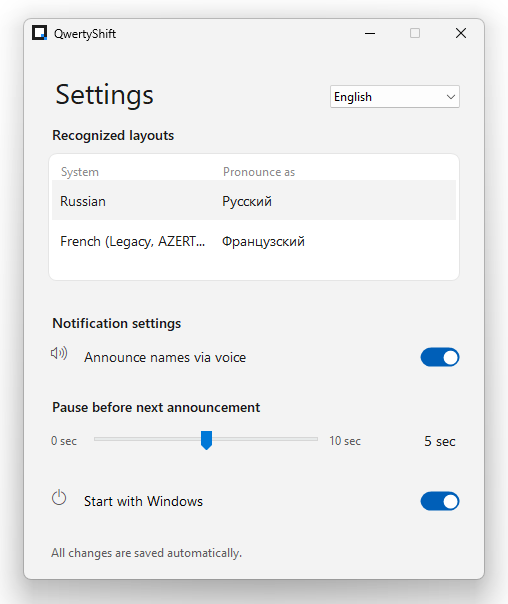

# QwertyShift ⌨️🔊

Never get confused by typing in the wrong language again. QwertyShift runs quietly in your system tray and lets you know exactly which layout is active without you having to look down or check the taskbar.
A lightweight, elegant Windows desktop application that provides smart audio feedback and voice announcements whenever you switch your keyboard layout.

## Key Features

* **Smart Typing Detection:** QwertyShift pauses its announcements while you are actively typing, ensuring it never interrupts your workflow.
* **Text-to-Speech (TTS):** Automatically announces the name of the newly selected layout aloud.
* **Custom Audio Support:** Prefer sounds over voice? Map specific `.wav` audio files to different languages.
* **Custom Layout Names:** Rename your layouts to whatever you want the voice synthesizer to say (e.g., change "English (US)" to just "English").
* **Fluent Design UI:** A clean, modern interface featuring Windows 11 design elements like rounded corners and toggle switches.
* **Background Execution:** Minimizes seamlessly to the system tray and starts automatically with Windows.

## Screenshots




## Installation & Usage

**Option 1: Download the executable (Easiest)**
1. Go to the [Releases](../../releases) tab on the right side of this page.
2. Download the latest `QwertyShift.zip` file.
3. Extract the folder and run `QwertyShift.exe`. 

**Option 2: Build from source**
1. Clone this repository to your local machine:
   ```bash
   git clone https://github.com/aharelka/QwertyShift.git
